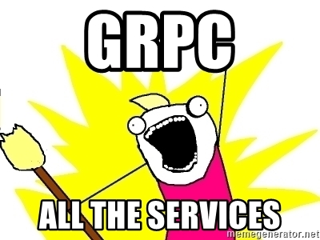

# GRPC sample service

## Server

This is ticket review score calculator that masquerades as GRPC sample service :)
Weights are used to amplify ratings by category:
```
weighted rating = (rating * weight) + rating
```

0-100 score gets calculated:
```
score = ((rating * weight) + rating)/((maxRating * weight) + maxRating) * 100
```

Reguired for building the project locally:
- **go**
- **[Protocol Buffer Compiler protoc](https://grpc.io/docs/protoc-installation/)**

Run service locally:
```bash
# Download dependencis
go mod download
# Generate protobuf file
./protoc-code.sh
# Optionally also vendor dependencies
go mod vendor -mod=readonly
# run the service
go run cmd/server/main.go
```

Supported service flags:
```bash
  -db-file="database.db": Path to SQLite file path
  -db-host="localhost": PostgreSQL address
  -db-name="": PostgreSQL database name
  -db-password="": PostgreSQL password
  -db-port=5432: PostgreSQL port
  -db-user="": PostgreSQL user
  -docs-path="./pb": Documentation html and proto definition directory
  -grpc-port=8080: Service port to listen for GRPC requests
  -http-port=8081: Service port to listen for HTTP requests
```
All the flags can also be passed in as environment variables.

If `-db-user`, `-db-password` and `db-name` it will try to connect to PostgreSQL. Otherwise it will attempt to open SQLite database file. By default it uses the SQLite database found in the repository.
There is also `migrate-to-psql.sh` to migrate data to a local PostgreSQL database.

Health check works with [grpc-health-probe](https://github.com/grpc-ecosystem/grpc-health-probe):
```bash
./grpc_health_probe -addr=:8080
```

In addition to GRPC methods the following HTTP methods are served:
- `/metrics` Prometheus metrics endpoint
- `/docs` Proto service documentation page
- `/proto` Service proto file

Also available in [Docker Hub](https://hub.docker.com/r/tanelmae/grpc-sample):
```bash
docker pull tanelmae/grpc-sample
```

---
## CLI client
Simple CLI client is found in `cmd/client/main.go`.

```bash
Supported subcommands and flags:

category-scores
  -from string
    	Start time for the period (default "2019-03-01")
  -to string
    	End time for the period (default "2019-04-01")

ticket-scores
  -from string
    	Start time for the period (default "2019-03-01")
  -to string
    	End time for the period (default "2019-04-01")

overal-score
  -from string
    	Start time for the period (default "2019-03-01")
  -out string
    	Format for the command output (default "silent")

period-diff
  -from string
    	Start time for the period (default "2019-03-01")
  -to string
    	End time for the period (default "2019-04-01")
  -second-from string
    	Start time for the period (default "2019-04-01")
  -second-to string
    	End time for the period (default "2019-04-30")

Shared flags for all commands
  -out string
    	Format for the command output (default "json")
      Also available: "table" and "silent"
  -addr string: Server address (default "localhost:8080")

```

Example:
```bash
batman@gotham:grpc-sample $ go run cmd/client/main.go period-diff -out table
+------------+--------+
|  CATEGORY  | CHANGE |
+------------+--------+
| Spelling   | 2 %    |
| Grammar    | 2 %    |
| GDPR       | -1 %   |
| Randomness | 0 %    |
+------------+--------+
```
